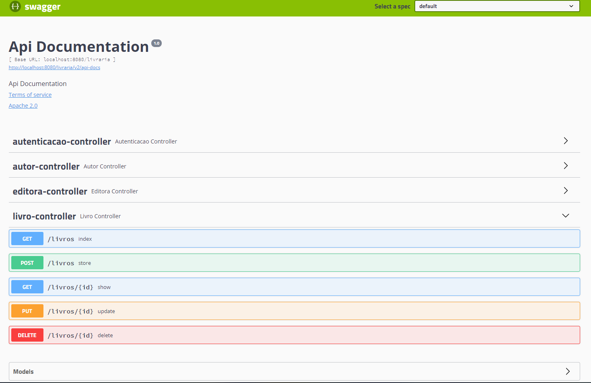

<h1 align="center">Livraria</h1>

🚀 Livraria é um projeto de uma API REST desenvolvido em Java com Spring Boot

<h4 align="center"> 
	🚧  Livraria 🚀 Em construção...  🚧
</h4>

<h2 align="center">
  
</h2>

### Features

- [ ] Front-end  
- [ ] ???

### 🛠 Tecnologias

As seguintes ferramentas foram usadas na construção do projeto:

- [Java 11](https://www.oracle.com/br/java/technologies/javase-jdk11-downloads.html)
- [Node.js](https://nodejs.org/en/)
- [Spring Boot 2.3.1](https://spring.io/projects/spring-boot)

### Recursos
* Database Pagination
* Segurança por Token
* Caching
* Swagger

### 🛠 Build 
* Crie uma base de dados
* Execute o script `src/main/resources/script/setup.sql`
* Execute o script `src/main/resources/script/setupLogin.sql` para Base de Login
* Edite o arquivo src/main/resources/application.properties com os dados do seu ambiente
